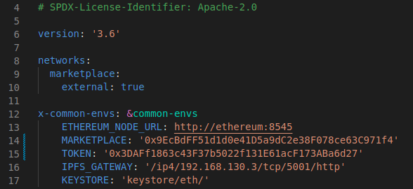

# Private Data Marketplace Testing Framework

This repository contains a complete testing framework of the private data marketplace that uses SMPC and blockchain technology. The [marketplace contract](./marketplace/contracts/marketplace.sol) is an Ethereum smart contract implemented in Solidity language. With the purpose of interacting with it, two Ethereum clients have been implemented: a [scientist client](./client/data-scientist-eth-client/) and a [data owner client](./client/data-owner-eth-client/). Both clients have been implemented in Python and allow a user to interact directly with the marketplace.

This framework allows to automatically deploy the marketplace in a local network. The events emitted by the smart contract are listened by an [Eventeum](https://github.com/eventeum/eventeum) instance that uses [Kafka](https://kafka.apache.org/) to capture them. The clients listen to the Eventeum instance to receive the events of the marketplace and make decisions depending on them. Each marketplace client contains inside an SMPC client to directly perform the SMPC executions.

Index of this tutorial:

- [Installation](#installation)
- [Running a campaign](#running-a-complete-campaign)
  - [Running a simple campaign (3 players)](#simple-campaign-for-3-players)
  - [Running a campaign with two bins](#campaign-with-5-players)
- [Closing repositories](#close-repositories)

## Installation

All the components needed to deploy the marketplace testing framework are encapsulated inside Docker containers. Firstly, build the Docker image for the marketplace clients with the following command:

```bash
./preinstall.sh
```

The above command will create three Docker images: one base image containing an SMPC agent, the image for the scientist and the image for the data owners. The latter two will be the images executing the marketplace clients. For the marketplace clients to be able to connect to the smart contract correctly, they must be deployed after the contract and the Eventeum listener. For this reason, we first deploy the 'cloud components' by running:

```bash
./start-bck.sh
```

This last command will at the end output a list of the deployed contracts. The list will be similar to this one:

```bash
Network: ethereum (id: 5777)
  Migrations: 0x29a0B5fCD981c9Ab33B144B8985b5015E42bb9a9
  Token: 0x3DAFf1863c43F37b5022f131E61acF173ABa6d27
  marketplace: 0x9EcBdFF51d1d0e41D5a9dC2e38F078ce63C971f4
```

The last two hexadecimal addresses are the ones running the marketplace:

- *Token:* is the address of the ERC-20 token that will be used to pay for the successful SMPC executions.
- *marketplace:* is the address of the smart contract deploying the private data marketplace.

Before deploying the clients, **you must introduce these two addresses as environment variables in their Docker deployments.** To do so, head to the [docker-compose file](./docker-compose-client.yml) and update lines 14 and 15 with the addresses you obtained from the last execution. In our example, these lines should be:



Observe that the variables `MARKETPLACE` and `TOKEN` have the same addresses as the ones obtained during the deployment. Once this is done, you can deploy the marketplace clients with the command:

```bash
./start-client.sh
```

When finished, you will have 5 participants running in different Docker containers.

## Running a complete campaign

Once the previous installation has been finished correctly, the network is ready to do some tests. There are exactly, five participants deployed:

- `p0`: the scientist.
- `p1`, `p2`, `p3` and `p4`: the data owners.

We show the execution of two different campaigns:

- [A campaign with only one bin and 3 players](#simple-campaign-for-3-players)
- [A campaign with two bins and 5 players](#campaign-with-5-players)

### Simple campaign for 3 players

In this campaign, only the following clients will be used:

- `p0`
- `p1`
- `p2`

First of all, run the client for the scientist (in `p0`). For this, open a terminal and enter the Docker container:

```bash
docker exec -it p0 bash
```

and once inside the container run:

```bash
./run_all.sh
```

At this very moment, you will see the following menu in your shell:

```bash
Which step want to run
  1) Start
  2) Balance
  3) Show reputation

  0) Exit

Choose a number: 
```

We will focus on the menu `Start`. Enter a 1 and you will see this submenu:

```bash
Choose among the following:
   1) New campaign.
   2) Enter working campaign.
   3) Reuse finished campaign.

   0) Back

Choose a number: 
```

Since we want to start a new campaign, enter 1 again. The first thing the application will ask for is to register inside the marketplace. Enter `y` to register and continue creating a campaign. Then the application will show you the available programs to be run using SMPC: `mean`, `linear-reg`, `knn` and `standard-dev`. For the sake of simplicity, we will run the `mean` program to compute a mean among three players. For this reason, we enter `mean` and now start to fill up all the parameters needed for the campaign. The list of them (in order) is:

1. MODL: 150
2. Data length: 50
3. Minumum reputation: 5
4. Amount of tokens to be paid: 5

Once these parameters are set, the application will automatically create a campaign in the marketplace, and will start to listen to its events (using the Eventeum consumer).

The next step will be to subscribe the data owners `p1` and `p2` to this campaign. Both subscribing processes are analogous, so here only the process for subscribing `p1` is described. First, open a new terminal and enter the container for `p1`:

```bash
docker exec -it p1 bash
```

Once inside, run the client by typing:

```bash
./run_all.sh
```

You will see the following menu:

```bash
Which step want to run
  1) Start
  2) Show balance
  3) Show reputation

  0) Exit

Choose a number: 
```

Enter 1 to start a new subscription. You will be asked to register in the marketplace, so enter `y` to continue. Then, the application will show you the campaigns that are available. In our case, the following information should be seen:

```bash
---------------------------------
        List of programs
---------------------------------


In program 1 : 

         --> We are at subscribing time   Subscribed players:   1

         --> Required reputation:  5

         --> MODL for the request:  150

         --> Reward between  0.016666666666666666  and 0.03333333333333333 tokens per data item used.


Enter the program index of the program you want to choose:
```

Thus, we enter 1 and start the subscription for this campaign (the one created by the scientist before). Then, we will be asked about our information to subscribe. To fill up this information, enter (in order) these parameters:

1. Data length: 50
2. Reputation to stake: 5

Then, the application will sign up for the campaign created by the scientist and start listening to events related to it. Recall to do the same subscribing process for `p2`.

Once both `p1` and `p2` have signed up for the campaign, the overall data length is 150 (50 per player) and thus the MODL is reached. This is why the scientist will receive that event and will be able to perform the grouping of the players into bins. In fact, in the scientist's terminal you will see:

```bash
################################

MODL REACHED FOR CAMPAIGN: 1

################################


Introduce the desired bin capacity considering that the MODL is 150 and your data length is 50: 
```

Thus we enter `100` for all players to finish up inside one bin. Then, the app will show on the screen the shape of the bin, showing the order of the players and their data length. This information must be used by the scientist to edit the MPC program inside `mean` for it to be sticked to those parameters and not having errors during the execution. In our case, this is not needed because the program is prepared to behave properly. Hence, enter 1 to continue.

At this moment, the application will automatically perform the following steps:

1. Compile the SMPC program and upload the executables to IPFS.
2. Tell the marketplace that the scientist is ready to continue with the campaign.
3. All players will receive an event telling the scientist has uploaded the execution files.
4. All players will download the necessary information to perform the SMPC execution.
5. All players will run the SMPC agent with the information obtained from the marketplace.
6. The execution will finish successfully for all of them, so each one will tell the marketplace that the execution ended up successfully.
7. All of them will receive an event telling that the execution finished successfully and the app will show the result of the execution in the screen.

That is the end of the execution of the campaign. Now it is possible to check that the reputations increased by 5 in all players and that the data owners received the payment corresponding to the data they used during the execution.

### Campaign with 5 players

In this campaign, only the following clients will be used:

- `p0`
- `p1`
- `p2`
- `p3`
- `p4`

First of all, run the client for the scientist (in `p0`). For this, open a terminal and enter the Docker container:

```bash
docker exec -it p0 bash
```

and once inside the container run:

```bash
./run_all.sh
```

At this very moment, you will see the following menu in your shell:

```bash
Which step want to run
  1) Start
  2) Balance
  3) Show reputation

  0) Exit

Choose a number: 
```

We will focus on the menu `Start`. Enter a 1 and you will see this submenu:

```bash
Choose among the following:
   1) New campaign.
   2) Enter working campaign.
   3) Reuse finished campaign.

   0) Back

Choose a number: 
```

Since we want to start a new campaign, enter 1 again. The first thing the application will ask for is to register inside the marketplace. Enter `y` to register and continue creating a campaign. Then the application will show you the available programs to be run using SMPC: `mean`, `linear-reg`, `knn` and `standard-dev`. For the sake of simplicity, we will run the `mean` program to compute a mean among three players. For this reason, we enter `mean` and now start to fill up all the parameters needed for the campaign. The list of them (in order) is:

1. MODL: 200
2. Data length: 20
3. Minumum reputation: 5
4. Amount of tokens to be paid: 5

Once these parameters are set, the application will automatically create a campaign in the marketplace, and will start to listen to its events (using the Eventeum consumer).

The next step will be to subscribe the data owners `p1`, `p2`, `p3` and `p4` to this campaign. The subscribing processes are analogous for all of them, so here only the process for subscribing `p1` is described. First, open a new terminal and enter the container for `p1`:

```bash
docker exec -it p1 bash
```

Once inside, run the client by typing:

```bash
./run_all.sh
```

You will see the following menu:

```bash
Which step want to run
  1) Start
  2) Show balance
  3) Show reputation

  0) Exit

Choose a number: 
```

Enter 1 to start a new subscription. You will be asked to register in the marketplace, so enter `y` to continue. Then, the application will show you the campaigns that are available. In our case, the following information should be seen:

```bash
---------------------------------
        List of programs
---------------------------------


In program 1 : 

         --> We are at subscribing time   Subscribed players:   1

         --> Required reputation:  5

         --> MODL for the request:  200

         --> Reward between  0.0125  and 0.025 tokens per data item used.


Enter the program index of the program you want to choose:
```

Thus, we enter 1 and start the subscription for this campaign (the one created by the scientist before). Then, we will be asked about our information to subscribe. To fill up this information, enter (in order) these parameters:

1. Data length: 30
2. Reputation to stake: 5

The parameters for `p2` are:

1. Data length: 40
2. Reputation to stake: 5

The parameters for `p3` are:

1. Data length: 50
2. Reputation to stake: 5

The parameters for `p4` are:

1. Data length: 60
2. Reputation to stake: 5

Then, the application will sign up for the campaign created by the scientist and start listening to events related to it. Recall to do the same subscribing process for `p2`, `p3` and `p4`.

Once all the data owners have signed up for the campaign, the overall data length is 200 (20+30+40+50+60) and thus the MODL is reached. This is why the scientist will receive that event and will be able to perform the grouping of the players into bins. In fact, in the scientist's terminal you will see:

```bash
################################

MODL REACHED FOR CAMPAIGN: 1

################################


Introduce the desired bin capacity considering that the MODL is 200 and your data length is 20: 
```

Thus we enter `60` in order for players to end up in two different bins. After executing the grouping protocol, the app will show on the screen the shape of the first bin, showing the order of the players and their data length. This information must be used by the scientist to edit the MPC program inside `mean` for it to be sticked to those parameters and not having errors during the execution. In our case, this is not needed because the program is prepared to behave properly. Hence, enter 1 to continue.

At this moment, the application will automatically perform the following steps:

1. Compile the SMPC program and upload the executables to IPFS.
2. Tell the marketplace that the scientist is ready to continue with the campaign for the first bin.
3. All players included in the first bin will receive an event telling the scientist has uploaded the execution files.
4. All players included in the bin will download the necessary information to perform the SMPC execution.
5. All players in the bin will run the SMPC agent with the information obtained from the marketplace.
6. The execution will finish successfully for all of them, so each one will tell the marketplace that the execution ended up successfully for bin 1.
7. All of them will receive an event telling that the execution finished successfully and the app will show the result of the execution in the screen.

That is the end of the execution for bin 1. Meanwhile, the clients from bin 2 did not receive any of the events and remain waiting for the marketplace to tell them they have been selected for a bin. On the other hand, once the scientist has finished the first execution, now can see in the screen the information of the execution for the second bin.

Again, it is time for the scientist to edit the MPC file containing the mean program with the information of the players from the second bin. In our case, again, it is not necessary to edit anything and the scientist just has to entre 1 to continue with the execution. This way, the execution process is repeated for the players in the second bin, happening the same steps for them than for the ones in the first bin (see steps 1 to 7 above).

Now it is possible to check that the reputations increased by 5 in all players and that the data owners received the payment corresponding to the data they used during the execution.

## Close repositories

To close all the repositories, run:

```bash
./stop.sh
```
